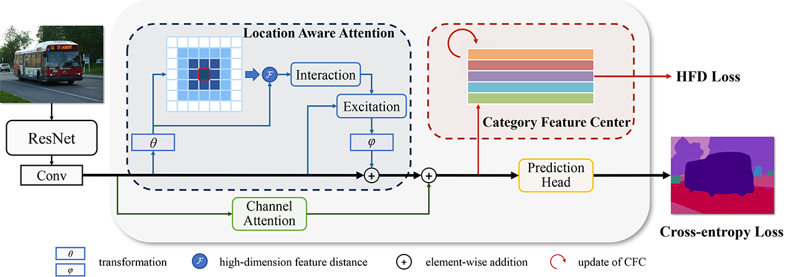
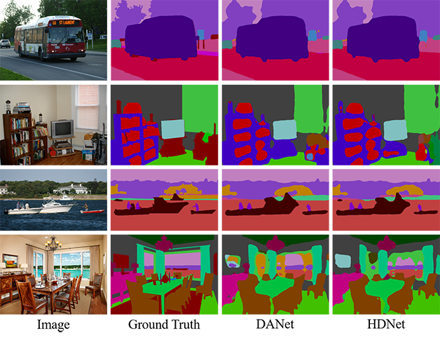
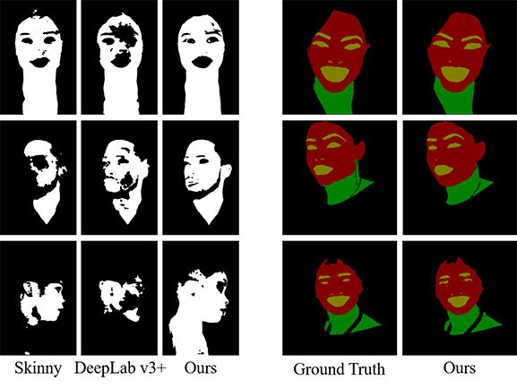

# [HDNet: Hybrid Distance Network for semantic segmentation](https://www.sciencedirect.com/science/article/pii/S0925231221004185)

A deep neural network with attention mechanism for semantic segmentation task.

&nbsp;


&nbsp;
- Segmentation results on PASCAL Context

  

&nbsp;
- Application on skin detection task

  

&nbsp;

## Requirements
- Install [PASCAL in Detail](https://sites.google.com/view/pasd/dataset)
- Install `requirements.txt`

## How to use
- To train HDNet:
```bash
python train.py --dataset pcontext_detail --out_dir /out_dir --pretrained_home /pretrained_home --data-folder /data-folder 
```
The model and log are saved in `--out_dir`

- To test HDNet:
```bash
python test.py --dataset pcontext_detail --resume-dir /resume-dir --data-folder /data-folder --pretrained_home /pretrained_home --eval --multi-scales

```

&nbsp;
## Citation
if you find HDNet useful in your research, please consider citing:

```
@article{li2021hdnet,
  title={HDNet: Hybrid Distance Network for semantic segmentation},
  author={Li, Chunpeng and Kang, Xuejing and Zhu, Lei and Ye, Lizhu and Feng, Panhe and Ming, Anlong},
  journal={Neurocomputing},
  volume={447},
  pages={129-144},
  year={2021},
  publisher={Elsevier}
}
```

## Acknowledgement
Thanks for [DANet](https://github.com/junfu1115/DANet), [PyTorch-Encoding](https://github.com/zhanghang1989/PyTorch-Encoding), [timm](https://github.com/rwightman/pytorch-image-models)